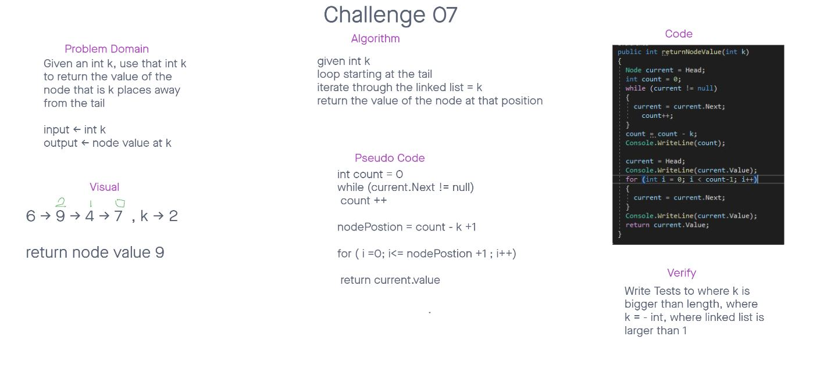

# Challenge 07

## Problem Domain
Given an int as a parameter return the node value that is int places away from the tail of Linked List

## Whiteboard

## Created with:
Miriam Silva we co write all of our labs and code challenges
## To run

In order to run this program you can download the zip file off github and open the solution title challenge07.
