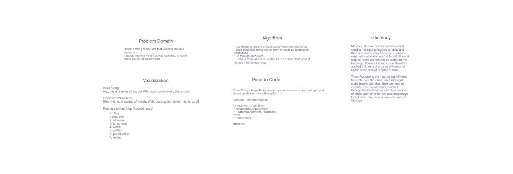
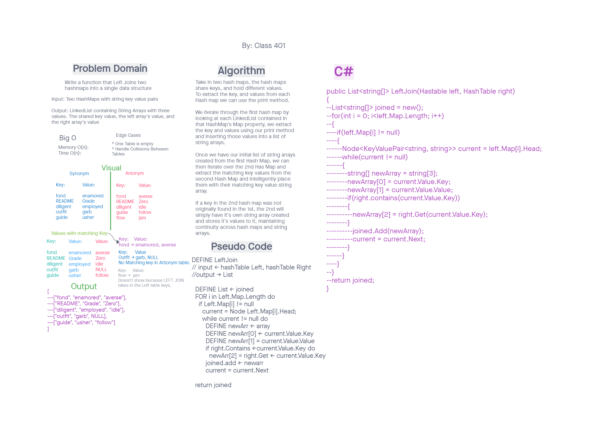

# Data Structures and Algorithms

#Code Challenge 31

## Problem Domain

We are to take in a string and find the repeated words in the string using a method and return the repeated word back.

## Collaborator 

Joel Connell and Charles Bofferding

I will include below the whiteboard for this code challenge.

## Language: `C#`

## Approach & Efficiency
The approach we took was to use a helper method to remove all special characters and capitalization from an array. Then the method split the string into an array of strings based on spacing.

Next, We used the primary method to find the first repeated value.

### Code Challenge 31 Whiteboard Process

# Code Challenge 33

## Problem Domain

Take in two hashtables and join them together into a single data structure

## Collaborator 

The entire Class 

## Language: `C#`

### Code Challenge 31 Whiteboard Process

