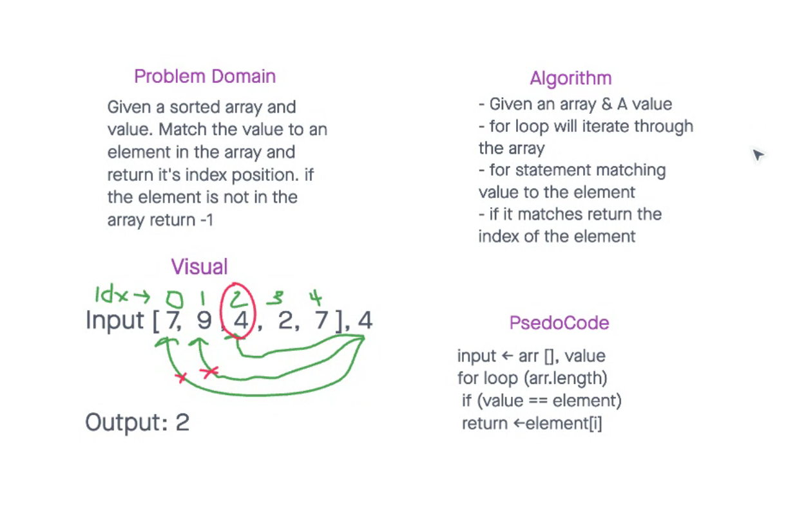

# Data Structures and Algorithms

## Language: `C#`

# Data Structures and Algorithms

## Collaborator 

Miriam Silva and Joel Connell
Extra help from Benjamin Ibarra

## Language: `C#`

### Code Challenge 1

### Code Challenge 2

### Code Challenge 3

### Code Challenge 6

### Code Challenge 7

### Code Challenge 16

### Code Challenge 9
